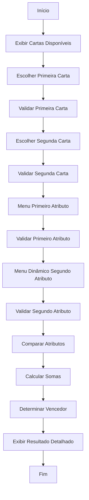

# 🎮 Super Trunfo - Desafio Final

Um jogo de cartas digital implementado em linguagem C que simula o clássico Super Trunfo com funcionalidades avançadas de comparação entre países.

## 📋 Índice

- [Sobre o Projeto](#sobre-o-projeto)
- [Funcionalidades](#funcionalidades)
- [Requisitos do Sistema](#requisitos-do-sistema)
- [Como Compilar e Executar](#como-compilar-e-executar)
- [Como Jogar](#como-jogar)
- [Estrutura do Código](#estrutura-do-código)
- [Exemplos de Uso](#exemplos-de-uso)
- [Tecnologias Utilizadas](#tecnologias-utilizadas)
- [Contribuição](#contribuição)

## 🎯 Sobre o Projeto

Este projeto é a culminação de uma série de desafios de programação em C, focando no uso avançado de **estruturas de decisão**. O Super Trunfo permite que jogadores escolham dois países e dois atributos para uma batalha épica baseada em dados reais.

### Objetivos Pedagógicos

- Implementação de **menus dinâmicos** usando `switch`
- Uso avançado de **estruturas condicionais** (`if-else` aninhados)
- Aplicação do **operador ternário** para código elegante
- **Validação robusta** de entrada do usuário
- **Organização modular** do código com funções especializadas

## ✨ Funcionalidades

### 🎲 Gameplay Avançado
- **Escolha de dois atributos** para comparação
- **Comparação individual** de cada atributo
- **Sistema de pontuação** baseado na soma dos atributos
- **Tratamento de empates** com mensagens específicas

### 🖥️ Interface Inteligente
- **Menus dinâmicos** que se adaptam às escolhas do jogador
- **Validação completa** de todas as entradas
- **Feedback visual** com emojis e formatação
- **Resultados detalhados** em formato de tabela

### 🏆 Sistema de Batalha
- **Regras especiais** para Densidade Demográfica (menor vence)
- **Comparação dupla** com soma de atributos
- **Determinação automática** do vencedor
- **Exibição clara** do resultado final

## 🔧 Requisitos do Sistema

- **Compilador C** (GCC, Clang, ou similar)
- **Sistema Operacional**: Windows, Linux ou macOS
- **Memória RAM**: Mínimo 512MB
- **Terminal/Console** para execução

## 🚀 Como Compilar e Executar

### Compilação

```bash
# Using GCC
gcc -o super_trunfo super_trunfo.c

# Using Clang
clang -o super_trunfo super_trunfo.c
```

### Execução

```bash
# Linux/macOS
./super_trunfo

# Windows
super_trunfo.exe
```

### Compilação com Flags de Debug (Recomendado)

```bash
gcc -Wall -Wextra -g -o super_trunfo super_trunfo.c
```

## 🎮 Como Jogar

### Passo 1: Escolha das Cartas
1. O sistema exibe 6 países disponíveis
2. Escolha a **primeira carta** (1-6)
3. Escolha a **segunda carta** (diferente da primeira)

### Passo 2: Seleção de Atributos
1. Escolha o **primeiro atributo** do menu principal
2. Escolha o **segundo atributo** do menu dinâmico (que não mostra o primeiro atributo)

### Passo 3: Batalha
- O sistema compara cada atributo individualmente
- Calcula a soma dos dois atributos para cada país
- Determina o vencedor baseado na maior soma
- Exibe resultado detalhado com tabelas formatadas

### 🏅 Atributos Disponíveis

| Atributo | Descrição | Regra de Vitória |
|----------|-----------|------------------|
| População | Número de habitantes | Maior vence |
| Área | Território em km² | Maior vence |
| PIB | Produto Interno Bruto (bilhões) | Maior vence |
| Pontos Turísticos | Quantidade de atrações | Maior vence |
| Densidade Demográfica | Habitantes por km² | **Menor vence** |
| PIB per Capita | PIB dividido pela população | Maior vence |

## 🏗️ Estrutura do Código

### Estrutura Principal

```c
typedef struct {
    char nome[50];
    int populacao;
    float area;
    float pib;
    int pontos_turisticos;
    float densidade_demografica;
    float pib_per_capita;
} Carta;
```

### Funções Principais

| Função | Propósito |
|--------|-----------|
| `exibirMenuAtributos()` | Exibe menu principal de atributos |
| `exibirMenuDinamico()` | Exibe menu sem atributo já escolhido |
| `obterNomeAtributo()` | Retorna nome do atributo por ID |
| `obterValorAtributo()` | Extrai valor do atributo da carta |
| `validarAtributoDinamico()` | Valida escolha no menu dinâmico |
| `compararAtributo()` | Compara atributo específico entre cartas |
| `exibirResultado()` | Mostra resultado detalhado da batalha |

### Fluxo de Execução



## 💡 Exemplos de Uso

### Exemplo de Batalha: Brasil vs França

```
🥊 BATALHA: Brasil VS França

Atributos escolhidos:
• População
• PIB (bilhões)

======================== RESULTADO DA BATALHA ========================
País 1: Brasil
País 2: França

--- VALORES DOS ATRIBUTOS ---
País                      | População       | PIB (bilhões)  
---------------------------------------------------------
Brasil                    | 215000000       | 2055.00        
França                    | 68000000        | 2630.00        

--- COMPARAÇÃO POR ATRIBUTO ---
População: Brasil vence!
PIB (bilhões): França vence!

--- SOMA DOS ATRIBUTOS ---
Brasil: 215002055.00
França: 68002630.00

★★★ RESULTADO FINAL ★★★
🏆 VENCEDOR: Brasil!
Diferença: 146999425.00 pontos
================================================================
```

## 🛠️ Tecnologias Utilizadas

- **Linguagem**: C (C99 Standard)
- **Bibliotecas**: 
  - `stdio.h` - Entrada e saída
  - `string.h` - Manipulação de strings
- **Recursos de C**:
  - Estruturas (`struct`)
  - Ponteiros e arrays
  - Estruturas de decisão (`if-else`, `switch`)
  - Operador ternário
  - Funções modulares

## 🔍 Recursos Técnicos Avançados

### Menus Dinâmicos
```c
void exibirMenuDinamico(int atributoEscolhido) {
    if (atributoEscolhido != 1) printf("1. População\n");
    if (atributoEscolhido != 2) printf("2. Área (km²)\n");
    // ... continua para todos os atributos
}
```

### Operador Ternário
```c
char* vencedor = (soma1 > soma2) ? carta1.nome : 
                (soma2 > soma1) ? carta2.nome : "EMPATE";
```

### Validação Robusta
```c
int validarAtributoDinamico(int atributo, int primeiroAtributo) {
    return (atributo >= 1 && atributo <= 6 && atributo != primeiroAtributo);
}
```

## 📊 Dados dos Países

O jogo inclui 6 países pré-cadastrados com dados realistas:

| País | População | Área (km²) | PIB (bi) | Pontos Turísticos | Densidade | PIB per Capita |
|------|-----------|------------|----------|-------------------|-----------|----------------|
| Brasil | 215M | 8.515M | 2.055 | 12 | 25.3 | 9.574 |
| França | 68M | 643K | 2.630 | 15 | 105.6 | 38.625 |
| Japão | 125M | 378K | 4.231 | 8 | 330.8 | 33.854 |
| Alemanha | 83M | 357K | 3.570 | 10 | 232.4 | 43.028 |
| Canadá | 38M | 9.985M | 1.644 | 9 | 3.8 | 43.278 |
| Austrália | 26M | 7.692M | 1.323 | 7 | 3.4 | 50.870 |

## 🐛 Tratamento de Erros

O sistema implementa validação completa para:

- ✅ **Entradas inválidas** nos menus
- ✅ **Escolha de cartas repetidas**
- ✅ **Seleção de atributos duplicados**
- ✅ **Valores fora do intervalo válido**
- ✅ **Entrada não numérica**

## 🤝 Contribuição

Para contribuir com o projeto:

1. Fork o repositório
2. Crie uma branch para sua feature (`git checkout -b feature/AmazingFeature`)
3. Commit suas mudanças (`git commit -m 'Add some AmazingFeature'`)
4. Push para a branch (`git push origin feature/AmazingFeature`)
5. Abra um Pull Request

### Ideias para Melhorias

- [ ] Sistema de pontuação acumulativa
- [ ] Mais países e atributos
- [ ] Interface gráfica (GUI)
- [ ] Modo multiplayer
- [ ] Salvar/carregar partidas
- [ ] Rankings e estatísticas

## 📄 Licença

Este projeto é educacional e está disponível sob a licença MIT. Veja o arquivo `LICENSE` para detalhes.

## 👨‍💻 Autor

Desenvolvido como parte do **Desafio Final** de programação em C, focando no domínio de estruturas de decisão e desenvolvimento de interfaces interativas em terminal.

---

⭐ **Se você gostou do projeto, não esqueça de dar uma estrela!** ⭐